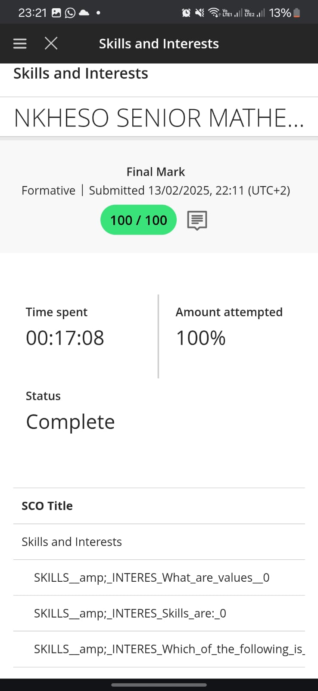

# 💡 Skills & Interests

## 📁 Evidence

  
*Screenshot of completed skills and interests checklist*

---

## ✨ Reflection – STAR Technique

**S**ituation:  
To align my career goals with my strengths, I needed to identify my key skills and interests.

**Task:  
Complete a skills inventory and analyze how it connects with my future plans.

**Action:  
I took time to assess my communication, technical, and leadership abilities through an interest-skills worksheet.

**R**esult:  
The results confirmed that I enjoy problem-solving, teamwork, and working with digital systems – all relevant to my future in tech.
